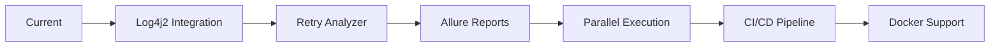

<div align="center">

# 🚀 SauceDemo Selenium Automation Framework

### *A clean, powerful & industry-standard Test Automation Framework*

[](https://www.oracle.com/java/)
[](https://www.selenium.dev/)
[](https://testng.org/)
[](https://maven.apache.org/)
[](https://extentreports.com/)


---

### 📌 Built with Selenium + TestNG + POM + Extent Reports

*Perfect for interviews, portfolios, and real-world automation learning*

</div>

---

## 📋 Table of Contents

- [✨ Overview](#-overview)
- [🎯 Key Features](#-key-features)
- [📁 Project Architecture](#-project-architecture)
- [🛠️ Tech Stack](#️-tech-stack)
- [⚡ Quick Start](#-quick-start)
- [🧪 Test Coverage](#-test-coverage)
- [📊 Reports & Screenshots](#-reports--screenshots)
- [🔮 Roadmap](#-roadmap)
- [👨‍💻 Author](#-author)
- [⭐ Support](#-support)

---

## ✨ Overview

<div align="center">

```ascii
╔═══════════════════════════════════════════════════════════╗
║  Professional-Grade Test Automation Framework            ║
║  🎯 POM Design Pattern                                   ║
║  📊 Advanced Reporting                                   ║
║  🔄 Modular & Scalable                                   ║
║  ✅ Industry Best Practices                              ║
╚═══════════════════════════════════════════════════════════╝
```

</div>

This repository showcases a **production-ready Selenium Test Automation Framework** built for the **[SauceDemo](https://www.saucedemo.com/)** e-commerce platform.

### 🎯 Perfect For

<table>
<tr>
<td align="center">💼<br/><b>Job Interviews</b></td>
<td align="center">📚<br/><b>Learning Selenium</b></td>
<td align="center">🎓<br/><b>QA Portfolio</b></td>
<td align="center">🏢<br/><b>Enterprise Projects</b></td>
</tr>
</table>

---

## 🎯 Key Features

<div align="center">

| Feature | Description |
|:-------:|:------------|
| 🏗️ **Page Object Model** | Clean separation of test logic, page actions, and web elements |
| 📊 **Extent Reports** | Beautiful HTML reports with step logs, screenshots & system info |
| 📸 **Smart Screenshots** | Automatic capture on test failures with timestamped filenames |
| 🔧 **Reusable Utilities** | Modular utility classes for screenshots and report management |
| ✅ **E2E Test Coverage** | Complete automation of login, cart, checkout workflows |
| 🚀 **WebDriverManager** | Automatic browser driver management - zero manual setup |
| ⚡ **TestNG Integration** | Powerful test execution, grouping, and parallel capabilities |
| 📦 **Maven Build** | Simplified dependency management and build automation |

</div>

---

## 📁 Project Architecture

<div align="center">

```
📦 saucedemo-selenium-testng-framework
┣ 📂 src/main/java
┃ ┣ 📂 pages              # Page Object Classes
┃ ┃ ┣ 📄 LoginPage.java
┃ ┃ ┣ 📄 ProductsPage.java
┃ ┃ ┣ 📄 CartAndCheckoutPage.java
┃ ┗ 📂 utils              # Utility Classes
┃   ┣ 📄 ScreenshotUtil.java
┃   ┗ 📄 ExtentReportManager.java
┣ 📂 src/test/java
┃ ┗ 📂 tests              # Test Classes
┃   ┣ 📄 LoginTest.java
┃   ┣ 📄 ProductTest.java
┃   ┗ 📄 CartAndCheckoutTest.java
┣ 📂 reports              # HTML Reports (Auto-generated)
┣ 📂 screenshots          # Failure Screenshots
┣ 📄 testng.xml           # TestNG Configuration
┗ 📄 pom.xml              # Maven Dependencies
```

</div>

<div align="center">

</div>

---

## 🛠️ Tech Stack

<div align="center">

<table>
<tr>
<td align="center" width="96">

<br><b>Java 17+</b>
</td>
<td align="center" width="96">

<br><b>Selenium</b>
</td>
<td align="center" width="96">

<br><b>Maven</b>
</td>
<td align="center" width="96">

<br><b>TestNG</b>
</td>
</tr>
</table>

### 📚 Dependencies

| Tool | Purpose | Version |
|:-----|:--------|:-------:|
| **Selenium WebDriver** | Browser automation & interaction | 4.x |
| **TestNG** | Test execution framework & assertions | 7.x |
| **WebDriverManager** | Automatic driver management | 5.x |
| **Extent Reports** | Advanced HTML reporting | 5.x |
| **Apache Maven** | Build & dependency management | 3.x |

</div>

---

## ⚡ Quick Start

### Prerequisites

<div align="center">

```bash
☕ Java 17 or higher
📦 Apache Maven 3.6+
🌐 Chrome/Firefox browser
```

</div>

### 🚀 Installation & Execution

<details open>
<summary><b>1️⃣ Clone the Repository</b></summary>

```bash
git clone https://github.com/Mankodi2003/saucedemo-selenium-testng-framework.git
cd saucedemo-selenium-testng-framework
```

</details>

<details open>
<summary><b>2️⃣ Install Dependencies</b></summary>

```bash
mvn clean install
```

</details>

<details open>
<summary><b>3️⃣ Run Test Suite</b></summary>

```bash
# Run all tests
mvn test

# Run specific test class
mvn test -Dtest=LoginTest

# Run with custom testng.xml
mvn test -DsuiteXmlFile=testng.xml
```

</details>

<details open>
<summary><b>4️⃣ View Reports</b></summary>

```bash
📊 Extent Report: /reports/TestReport_<timestamp>.html
📸 Screenshots:   /screenshots/
```

</details>

---

## 🧪 Test Coverage

<div align="center">

### 🔐 Login Module

| Test Case | Status |
|:----------|:------:|
| Valid user login | ✅ |
| Invalid credentials | ✅ |
| Locked user validation | ✅ |
| Empty field validation | ✅ |

### 🛒 Shopping Flow

| Test Case | Status |
|:----------|:------:|
| Add products to cart | ✅ |
| Remove products from cart | ✅ |
| Cart badge counter | ✅ |
| Cart persistence | ✅ |

### 📦 Checkout Process

| Test Case | Status |
|:----------|:------:|
| Complete checkout flow | ✅ |
| User information validation | ✅ |
| Order summary verification | ✅ |
| Success message validation | ✅ |

</div>

### 🎯 Test Scenarios Detailed

```
✅ Login Tests
   ├─ Valid user authentication
   ├─ Invalid credential handling
   ├─ Locked user detection
   └─ Empty field validation

✅ Product Tests
   ├─ Add single/multiple products
   ├─ Remove products from cart
   ├─ Product sorting validation
   └─ Product detail navigation

✅ Cart & Checkout Tests
   ├─ Cart item management
   ├─ Checkout information form
   ├─ Payment information
   ├─ Order summary validation
   └─ Order confirmation
```

---

## 📊 Reports & Screenshots

<div align="center">

### 🎨 Extent Report Features

<table>
<tr>
<td align="center">📝<br/><b>Detailed Step Logs</b></td>
<td align="center">🎯<br/><b>Status Badges</b></td>
<td align="center">📸<br/><b>Failure Screenshots</b></td>
<td align="center">💻<br/><b>System Information</b></td>
</tr>
</table>

### ✅ Report Highlights

```
✔ Test execution timeline
✔ Pass/Fail/Skip statistics
✔ Exception logs with stack traces
✔ Environment details (OS, Browser, Java version)
✔ Embedded screenshots for failed tests
✔ Timestamped report generation
✔ Interactive HTML dashboard
```

### 📸 Screenshot Management

- ✅ **Automatic capture** on test failure
- ✅ **Timestamped filenames** for easy tracking
- ✅ **Embedded in reports** for quick analysis
- ✅ **Organized folder structure** for maintenance

</div>

---

## 🔮 Roadmap

<div align="center">

### 🚀 Upcoming Enhancements



</div>

<table>
<tr>
<td>

**Phase 1: Logging** 🎯
- [ ] Log4j2 integration
- [ ] Custom log levels
- [ ] Log file rotation

</td>
<td>

**Phase 2: Reliability** 🔄
- [ ] Retry analyzer for flaky tests
- [ ] Test data management
- [ ] Cross-browser testing

</td>
</tr>
<tr>
<td>

**Phase 3: Reporting** 📊
- [ ] Allure report integration
- [ ] Custom report templates
- [ ] Email notifications

</td>
<td>

**Phase 4: CI/CD** ⚙️
- [ ] GitHub Actions pipeline
- [ ] Docker containerization
- [ ] Cloud execution (Selenium Grid)

</td>
</tr>
</table>

---

## 👨‍💻 Author

<div align="center">


### **Prasiddh Mankodi**

*Junior Automation Tester | QA Enthusiast*

[](https://linkedin.com/in/prasiddh-mankodi)
[](https://github.com/Mankodi2003)
[](mailto:ldit2025@gmail.com)

---

### 💡 Passionate About

`Automation` • `Selenium` • `Java` • `Frameworks` • `Problem Solving` • `Clean Code`

</div>

---

## ⭐ Support

<div align="center">

### If you find this framework helpful, please consider:

[](https://github.com/Mankodi2003/saucedemo-selenium-testng-framework)
[](https://github.com/YOUR-USERNAME/saucedemo-selenium-testng-framework/fork)
[](https://github.com/YOUR-USERNAME/saucedemo-selenium-testng-framework)

### 🌟 Give it a Star | 🍴 Fork it | 📢 Share it


---

### 📜 License

This project is licensed under the MIT License - see the [LICENSE](LICENSE) file for details.

---

<p align="center">Made with ❤️ and ☕ by <b>Prasiddh Mankodi</b></p>

<p align="center">
  
</p>

</div>
